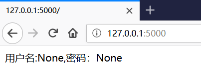
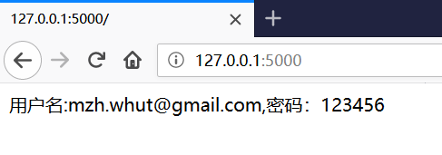

# Pipenv虚拟环境的使用 (20190310)

- <https://hellopython.readthedocs.io/zh_CN/latest/pipenv.html>

pipenv 是Kenneth Reitz大神的作品，提供Python的各个版本间的管理，各种包管理。是virtualenv pip等工具的合体。

## Pipenv的优点
- 自动关联项目相关的 **virtualenv**，能够快速的加载 **virtualenv** 。
- 提供的pipenv替代pip并自带一个依赖清单Pipfile，和依赖锁定Pipfile.lock。
- Pipfile除了依赖清单还支持固定pypi源地址,固定python版本。
- Pipfile还支持dev依赖清单.pipenv install的包会强制使用Pipfile中的源.
- 使用pipenv graph命令可以看到依赖树。
- 可以直接切换python2,3。
- 可通过自动加载 .env 读取环境变量，简化开发流程。

## Pipenv的缺点
- windows上切入virtualenv,命令行开头无virtualenv名字。
- Pipfile中的pypi源无法默认设置，造成每次都需要手动修改。

## Pipenv的安装

本文使用Python3.6.2作为测试环境。

Python3.6.2安装文件的下载地址如下：https://www.python.org/downloads/release/python-362/

安装后会自动安装pip，请提前修改pip源地址。

使用pip安装Pipenv:

```shell
$ pip install pipenv
Looking in indexes: http://mirrors.aliyun.com/pypi/simple/
Collecting pipenv
  Downloading http://mirrors.aliyun.com/pypi/packages/13/b4/3ffa55f77161cff9a5220f162670f7c5eb00df52e00939e203f601b0f579/pipenv-2018.11.26-py3-none-any.whl (5.2MB)
    100% |████████████████████████████████| 5.2MB 8.3MB/s
Requirement already satisfied: certifi in d:\program files (x86)\python3.6.2\lib\site-packages (from pipenv) (2018.1.18)
Requirement already satisfied: setuptools>=36.2.1 in d:\program files (x86)\python3.6.2\lib\site-packages (from pipenv) (40.6.2)
Requirement already satisfied: virtualenv in d:\program files (x86)\python3.6.2\lib\site-packages (from pipenv) (16.0.0)
Requirement already satisfied: virtualenv-clone>=0.2.5 in d:\program files (x86)\python3.6.2\lib\site-packages (from pipenv) (0.4.0)
Requirement already satisfied: pip>=9.0.1 in d:\program files (x86)\python3.6.2\lib\site-packages (from pipenv) (18.1)
Installing collected packages: pipenv
Successfully installed pipenv-2018.11.26
```

## Pipenv环境变量配置

在环境变量中配置变量
**PIPENV\_VENV\_IN\_PROJECT**，pipenv会在当前目录下创建.venv的目录，以后都会把模块装到这个.venv下:

`PIPENV_VENV_IN_PROJECT=1`

设置 **PIPENV\_PYPI\_MIRROR**，配置pypi源地址(检查发现此种方式不起作用):

`PIPENV_PYPI_MIRROR=https://mirrors.aliyun.com/pypi/simple`

设置 **PIPENV\_TEST\_INDEX**，配置pypi源地址:

`PIPENV_TEST_INDEX=https://mirrors.aliyun.com/pypi/simple`

如果后面发现PIPENV\_TEST\_INDEX未起作用，修改Pipenv源码文件python3.6.2\\Lib\\site-packages\\pipenv\\project.py的127行，将u"[https://pypi.org/simple"改成u"https://mirrors.aliyun.com/pypi/simple](https://pypi.org/simple%22改成u%22https://mirrors.aliyun.com/pypi/simple)"。

## 创建Pipenv虚拟环境

切换到项目目录下，并创建虚拟环境:

```shell
$ mkdir myproject

D:\data
$ cd myproject\

D:\data\myproject
$ ls

D:\data\myproject
$ pipenv install
Creating a virtualenv for this project…
Pipfile: D:\data\myproject\Pipfile
Using d:\program files (x86)\python3.6.2\python.exe (3.6.2) to create virtualenv…
[  ==] Creating virtual environment...Already using interpreter d:\program files (x86)\python3.6.2\python.exe
Using base prefix 'd:\\program files (x86)\\python3.6.2'
New python executable in D:\data\myproject\.venv\Scripts\python.exe
Installing setuptools, pip, wheel...done.

Successfully created virtual environment!
Virtualenv location: D:\data\myproject\.venv
Creating a Pipfile for this project…
Pipfile.lock not found, creating…
Locking [dev-packages] dependencies…
Locking [packages] dependencies…
Updated Pipfile.lock (ca72e7)!
Installing dependencies from Pipfile.lock (ca72e7)…
  ================================ 0/0 - 00:00:00
To activate this project's virtualenv, run pipenv shell.
Alternatively, run a command inside the virtualenv with pipenv run.

D:\data\myproject
$
```

初始化虚拟环境后，会在项目目录下生成Pipfile和Pipfile.lock，以及目录.venv。如下图所示：


Pipfile和Pipfile.lock为pipenv包的配置文件，代替原来的 requirement.txt。

项目提交时，可将Pipfile 文件和Pipfile.lock文件一并提交,待其他开发克隆下载，根据此Pipfile运行命令pipenv install --dev生成自己的虚拟环境。

通过pipenv install初始化虚拟环境时，Pipenv会查找本地安装的Python版本，作为Pipenv虚拟环境的基础，并仅安装setuptools, pip, wheel三个包。

## 在Virtualenv中执行命令

通过pipenv run *command* 可查在Virtualenv虚拟环境中执行命令，如下使用pipenv run pip
list查看安装的包:

```shell
$ pipenv run pip list
Loading .env environment variables…
Package    Version
---------- -------
pip        18.1
setuptools 40.6.2
wheel      0.32.3
```

## 安装包

使用pipenv install *package\_name* 安装Python包:

```shell
$ pipenv install flask
Installing flask…
Adding flask to Pipfile's [packages]…
Installation Succeeded
Pipfile.lock (4a5fad) out of date, updating to (a8f5d4)…
Locking [dev-packages] dependencies…
Locking [packages] dependencies…
Success!
Updated Pipfile.lock (4a5fad)!
Installing dependencies from Pipfile.lock (4a5fad)…
  ================================ 6/6 - 00:00:01
To activate this project's virtualenv, run pipenv shell.
Alternatively, run a command inside the virtualenv with pipenv run.
```

此时再查看安装的包的情况:

```shell
$ pipenv run pip list
Loading .env environment variables…
Package      Version
------------ -------
Click        7.0
Flask        1.0.2
itsdangerous 1.1.0
Jinja2       2.10
MarkupSafe   1.1.0
pip          18.1
setuptools   40.6.2
Werkzeug     0.14.1
wheel        0.32.3
```

以上命令只能查看到安装的包的情况，但并不知道包之间的依赖关系。可以使用pipenv graph查看包的依赖关系。

## 查看安装的包和依赖关系

使用pipenv graph查看包的依赖关系:

```shell
$ pipenv graph
Flask==1.0.2
  - click [required: >=5.1, installed: 7.0]
  - itsdangerous [required: >=0.24, installed: 1.1.0]
  - Jinja2 [required: >=2.10, installed: 2.10]
    - MarkupSafe [required: >=0.23, installed: 1.1.0]
  - Werkzeug [required: >=0.14, installed: 0.14.1]
```

## 将包导出到requirement.txt文件

使用pipenv lock -r \> requirements.txt 命令依赖包导出到文件:

```shell
$ pipenv lock -r > requirements.txt

$ cat requirements.txt
-i https://mirrors.aliyun.com/pypi/simple/
click==7.0
flask==1.0.2
itsdangerous==1.1.0
jinja2==2.10
markupsafe==1.1.0
werkzeug==0.14.1
```

## 通过requirements.txt安装包

可以将requirements.txt给别人，别人通过requirements.txt安装包:

```shell
$ mkdir ..\my_new_project

$ cp requirements.txt  ..\my_new_project\

$ cd ..\my_new_project\

$ pipenv install -r requirements.txt
Creating a virtualenv for this project…
Pipfile: D:\data\my_new_project\Pipfile
Using d:\program files (x86)\python3.6.2\python.exe (3.6.2) to create virtualenv…
[    ] Creating virtual environment...Already using interpreter d:\program files (x86)\python3.6.2\python.exe
Using base prefix 'd:\\program files (x86)\\python3.6.2'
New python executable in D:\data\my_new_project\.venv\Scripts\python.exe
Installing setuptools, pip, wheel...done.

Successfully created virtual environment!
Virtualenv location: D:\data\my_new_project\.venv
Creating a Pipfile for this project…
Requirements file provided! Importing into Pipfile…
Pipfile.lock not found, creating…
Locking [dev-packages] dependencies…
Locking [packages] dependencies…
Success!
Updated Pipfile.lock (4c2105)!
Installing dependencies from Pipfile.lock (4c2105)…
  ================================ 6/6 - 00:00:02
To activate this project's virtualenv, run pipenv shell.
Alternatively, run a command inside the virtualenv with pipenv run.
```

检查新项目中的包的安装情况:

```shell
$ pipenv run pip list
Package      Version
------------ -------
Click        7.0
Flask        1.0.2
itsdangerous 1.1.0
Jinja2       2.10
MarkupSafe   1.1.0
pip          18.1
setuptools   40.6.2
Werkzeug     0.14.1
wheel        0.32.3
```

可以发现与原来项目中的包是一样的。

## 卸载包

通过pipenv uninstall *package\_name* 卸载包:

```shell
$ pipenv uninstall flask
Uninstalling flask…
Uninstalling Flask-1.0.2:
  Successfully uninstalled Flask-1.0.2

Removing flask from Pipfile…
Locking [dev-packages] dependencies…
Locking [packages] dependencies…
Success!
Updated Pipfile.lock (48af14)!
```

## 在Pipenv Shell环境下工作

使用pipenv shell启动shell环境:

```shell
$ pipenv shell
Launching subshell in virtual environment…
```

## 删除卸载环境

使用pipenv --rm 删除虚拟环境:

```shell
$ pipenv --rm
Removing virtualenv (D:\data\my_new_project\.venv)…
```

注意: 删除虚拟环境后，只是删除了.venv目录，但项目下面的Pipfile和Pipfile.lock并没有被删除。

## 指定Python路径安装虚拟环境

假如我想安装Python3.7的虚拟环境，尝试去初始化:

```shell
$ pipenv --python 3.7
Warning: Python 3.7 was not found on your system…
You can specify specific versions of Python with:
  $ pipenv --python path\to\python
```

说明我电脑系统中没有Python3.7，我可以通过指定Python的路径来初始化虚拟环境，这在linux系统中非root用户不想使用系统默认的Python环境时非常有用。

指定Python路径安装虚拟环境:

```shell
$ pipenv --python "D:\Program Files (x86)\python3.6.2\python.exe"
Creating a virtualenv for this project…
Pipfile: D:\data\my_newpro\Pipfile
Using D:\Program Files (x86)\python3.6.2\python.exe (3.6.2) to create virtualenv…
[==  ] Creating virtual environment...Using base prefix 'D:\\Program Files (x86)\\python3.6.2'
New python executable in D:\data\my_newpro\.venv\Scripts\python.exe
Installing setuptools, pip, wheel...done.
Running virtualenv with interpreter D:\Program Files (x86)\python3.6.2\python.exe

Successfully created virtual environment!
Virtualenv location: D:\data\my_newpro\.venv
Creating a Pipfile for this project…
```

## Pipenv的帮助文档

使用pipenv -h可以查看Pipenv的帮助文档信息:

```shell
$ pipenv -h
Usage: pipenv [OPTIONS] COMMAND [ARGS]...

Options:
  --where             Output project home information.  # 项目目录信息
  --venv              Output virtualenv information.  # 输出 virtualenv 的目录信息
  --py                Output Python interpreter information.  # 输出 Python 解析器的路径
  --envs              Output Environment Variable options.  # 输出可设置的环境变量
  --rm                Remove the virtualenv.  # 删除虚拟环境
  --bare              Minimal output.
  --completion        Output completion (to be eval d).
  --man               Display manpage.
  --support           Output diagnostic information for use in GitHub issues.
  --site-packages     Enable site-packages for the virtualenv.  [env var:
                      PIPENV_SITE_PACKAGES]
  --python TEXT       Specify which version of Python virtualenv should use.
  --three / --two     Use Python 3/2 when creating virtualenv.
  --clear             Clears caches (pipenv, pip, and pip-tools).  [env var:
                      PIPENV_CLEAR]
  -v, --verbose       Verbose mode.
  --pypi-mirror TEXT  Specify a PyPI mirror.  # 指定PyPI源
  --version           Show the version and exit.  # 显示Pipenv的版本
  -h, --help          Show this message and exit.


Usage Examples:
   Create a new project using Python 3.7, specifically:
   $ pipenv --python 3.7

   Remove project virtualenv (inferred from current directory):
   $ pipenv --rm

   Install all dependencies for a project (including dev):
   $ pipenv install --dev

   Create a lockfile containing pre-releases:
   $ pipenv lock --pre

   Show a graph of your installed dependencies:
   $ pipenv graph

   Check your installed dependencies for security vulnerabilities:
   $ pipenv check

   Install a local setup.py into your virtual environment/Pipfile:
   $ pipenv install -e .

   Use a lower-level pip command:
   $ pipenv run pip freeze

Commands:
  check      Checks for security vulnerabilities and against PEP 508 markers
             provided in Pipfile.  # 检查安全漏洞
  clean      Uninstalls all packages not specified in Pipfile.lock.
  graph      Displays currently-installed dependency graph information.  # 显示当前依赖关系图信息
  install    Installs provided packages and adds them to Pipfile, or (if no
             packages are given), installs all packages from Pipfile.  # 安装包
  lock       Generates Pipfile.lock.  # 生成Pipfile.lock
  open       View a given module in your editor.  # 在编辑器中查看一个特定模块
  run        Spawns a command installed into the virtualenv.  # 在 virtualenv 中执行命令
  shell      Spawns a shell within the virtualenv.  # 进入到虚拟Shell环境
  sync       Installs all packages specified in Pipfile.lock.
  uninstall  Un-installs a provided package and removes it from Pipfile.  # 卸载包
  update     Runs lock, then sync.  # 卸载当前所以依赖，然后安装最新包
```

## Pipenv自动加载配置文件

如果在项目目录中存在.env文件，那么在pipenv shell或pipenv
run中都会自动加载.env文件。这对于保存一些敏感信息非常重要。

将敏感信息保存到.env文件中，不使用硬代码写入到项目中:

```shell
$ cat .env
MAIL_USERNAME=mzh.whut@gmail.com
MAIL_PASSWORD=123456
SECRET_KEY=nobody know this
D:\data\myproject
$ pipenv shell
Loading .env environment variables…
Launching subshell in virtual environment…

$ python
Python 3.6.2 (v3.6.2:5fd33b5, Jul  8 2017, 04:57:36) [MSC v.1900 64 bit (AMD64)] on win32
Type "help", "copyright", "credits" or "license" for more information.
>>> import os
>>> os.environ.get('MAIL_USERNAME')
'mzh.whut@gmail.com'
>>> os.environ.get('MAIL_PASSWORD')
'123456'
>>> os.environ.get('SECRET_KEY')
'nobody know this'
```

## 在Flask中加载.env配置文件

示例文件如下:

```python
#!/usr/bin/python3
"""
@Author  : Zhaohui Mei(梅朝辉)
@Email   : mzh.whut@gmail.com

@Time    : 2018/11/27 23:32
@File    : myweb.py
@Version : 1.0
@Interpreter: Python3.6.2
@Software: PyCharm

@Description: 测试使用.env文件加载配置
"""
import os
from flask import Flask

# 创建类的实例，是一个WSGI应用程序
app = Flask(__name__)

@app.route('/')
def index():
    MAIL_USERNAME = os.environ.get('MAIL_USERNAME')
    MAIL_PASSWORD = os.environ.get('MAIL_PASSWORD')
    return f'用户名:{MAIL_USERNAME},密码：{MAIL_PASSWORD}'

if __name__ == '__main__':
    #  run()函数让应用运行在本地服务器上
    app.run(debug=True)
```

直接运行，在命令行显示结果如下:

```shell
D:\data\myproject\.venv\Scripts\python.exe D:/data/myproject/myweb.py
 * Tip: There are .env files present. Do "pip install python-dotenv" to use them.
 * Serving Flask app "myweb" (lazy loading)
 * Environment: production
   WARNING: Do not use the development server in a production environment.
   Use a production WSGI server instead.
 * Debug mode: on
 * Restarting with stat
 * Tip: There are .env files present. Do "pip install python-dotenv" to use them.
 * Debugger is active!
 * Debugger PIN: 174-500-507
 * Running on http://127.0.0.1:5000/ (Press CTRL+C to quit)
127.0.0.1 - - [27/Nov/2018 23:35:13] "GET / HTTP/1.1" 200 -
```

此时查看 <http://127.0.0.1:5000/> ，结果如下图所示:



可知Flask并没有获取到相应的配置数据，需要安装python-dotenv，在虚拟环境中安装:

```shell
$ pipenv install python-dotenv
Installing python-dotenv…
Adding python-dotenv to Pipfile's [packages]…
Installation Succeeded
Pipfile.lock (d90202) out of date, updating to (4a5fad)…
Locking [dev-packages] dependencies…
Locking [packages] dependencies…
Success!
Updated Pipfile.lock (d90202)!
Installing dependencies from Pipfile.lock (d90202)…
  ================================ 7/7 - 00:00:02
To activate this project's virtualenv, run pipenv shell.
Alternatively, run a command inside the virtualenv with pipenv run.

$ pipenv run pip list
Loading .env environment variables…
Package       Version
------------- -------
Click         7.0
Flask         1.0.2
itsdangerous  1.1.0
Jinja2        2.10
MarkupSafe    1.1.0
pip           18.1
python-dotenv 0.9.1
setuptools    40.6.2
Werkzeug      0.14.1
wheel         0.32.3
```

安装完成python-dotenv后，再重新运行Flask项目，重新访问 <http://127.0.0.1:5000/> ，结果如下图所示:



说明.env配置数据已经成功解析。

**注意:当将项目上传到github代码仓库时，请忽略掉.env文件，即将.env加入到.gitignore文件列表中**

参考文献：

- Python包和版本管理的最好工具----pipenv
<http://www.mamicode.com/info-detail-2214218.html?tdsourcetag=s_pcqq_aiomsg>
- pipenv使用
<https://www.jianshu.com/p/d06684101a3d?tdsourcetag=s_pcqq_aiomsg>
- pipenv的高级用法 <https://www.jianshu.com/p/8c6ae288ba48>
- Advanced Usage of Pipenv
<https://pipenv.readthedocs.io/en/latest/advanced/>
- PyPI中Pipenv的说明 <https://pypi.org/project/pipenv/>
